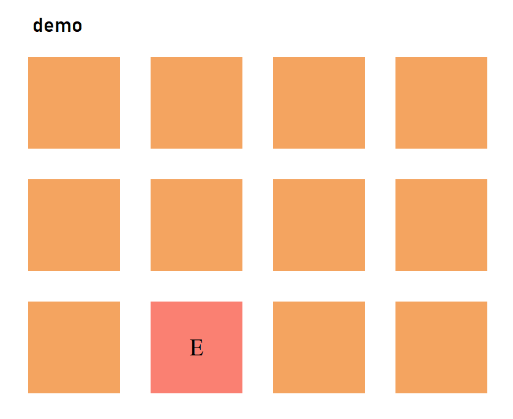

<h1 align="center">Игра "Найди пару" на JS</h1>

<h2 align="left">Описание проекта</h2>

Проект представляет собой классическую игру "Найди пару" для одного игрока. Цель игры - найти все парные карточки.

Просмотреть проект можно на GitHub Pages по ссылке: https://cicada0909.github.io/MemoryGameJs/

Цель создания проекта - закрепление навыков по JavaScript и организации классов в соответствии с принципами ООП.

<h2 align="left">Функциональность проекта и использованные технологии</h2>

Внешний вид игры стилизован с помощью HTML и CSS.

Вся логика игры написана на чистом JavaScript:
